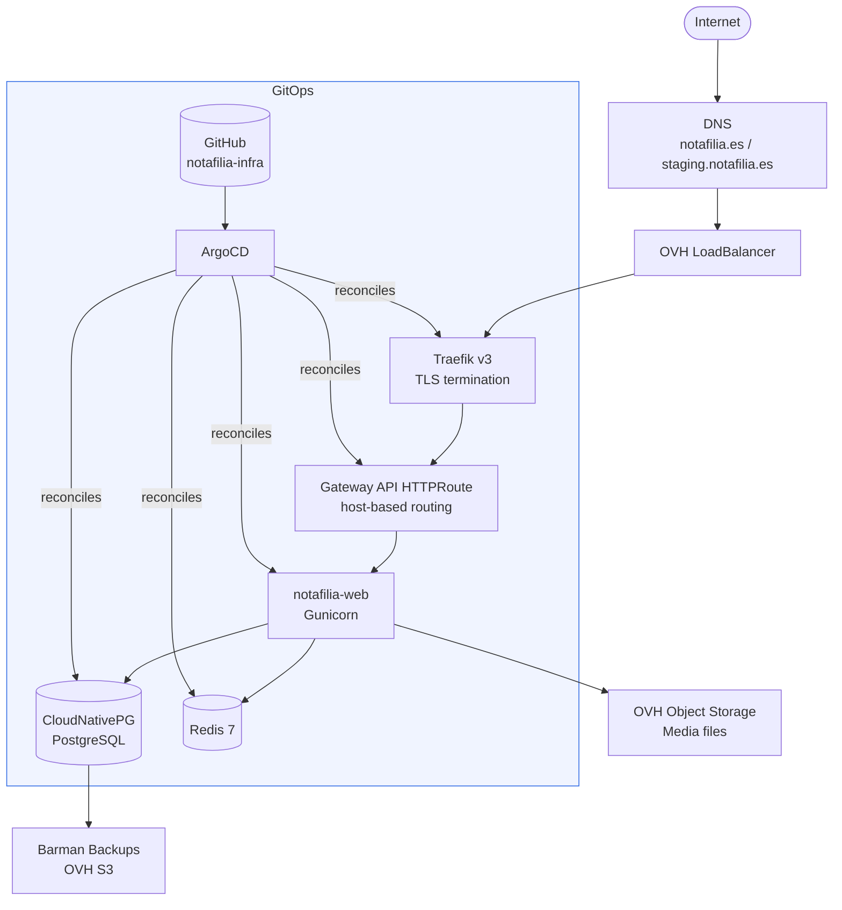

<div align="center">

# notafilia-infra

**Production Kubernetes infrastructure for [Notafilia](https://github.com/RafaFuentes4/notafilia) — a Django application deployed to OVH Managed Kubernetes using a full GitOps stack.**

*The cluster state is fully declarative and driven by this repository. No manual `kubectl apply`, no configuration drift.*

[](https://notafilia.es)
[](https://staging.notafilia.es)

</div>

---

## Stack

<div align="center">


</div>

| Concern | Tool | Why |
|---------|------|-----|
| GitOps controller | **ArgoCD** | App-of-apps pattern, self-healing, drift detection |
| App manifests | **Kustomize** | Plain YAML with environment overlays — no templating engine needed |
| Ingress | **Traefik v3 + Gateway API** | Modern routing standard, replaces legacy Ingress resource |
| TLS | **cert-manager + Let's Encrypt** | Fully automated certificate lifecycle |
| Secrets | **SOPS + age** | Value-level encryption in Git — safe to commit, no in-cluster controller needed |
| PostgreSQL | **CloudNativePG operator** | Production-grade PG on K8s with declarative lifecycle management |
| Async tasks | **Celery + Redis** | Worker and beat scheduler as separate Deployments |
| Media storage | **OVH Object Storage (S3-compatible)** | Offloaded from pods via django-storages |
| DB backups | **Barman → OVH S3** | Daily scheduled backups with retention policy |
| CI/CD | **GitHub Actions → GHCR** | Image built and pushed on merge to main |
| Cluster | **OVH Managed Kubernetes** (GRA9, B3-8) | Managed control plane, Cinder persistent volumes |

---

## Architecture



---

## Repository Structure

```
notafilia-infra/
├── base/                          # Kustomize base — shared app manifests
│   ├── deployment-web.yaml        # Gunicorn + Django migrate init container
│   ├── deployment-celery.yaml     # Async task worker
│   ├── deployment-beat.yaml       # Celery beat scheduler (Recreate strategy)
│   ├── service-web.yaml           # ClusterIP on port 8000
│   ├── configmap.yaml             # Non-secret environment variables
│   └── httproute.yaml             # Gateway API HTTPRoute (hostname overridden per env)
│
├── overlays/
│   ├── staging/                   # namespace: staging · host: staging.notafilia.es
│   │   ├── kustomization.yaml     # Patches + image tag
│   │   └── secrets.enc.yaml       # SOPS-encrypted secrets (safe to commit)
│   └── production/                # namespace: production · host: notafilia.es
│       ├── kustomization.yaml
│       └── secrets.enc.yaml
│
├── infrastructure/                # Third-party services as ArgoCD Applications
│   ├── traefik/                   # Traefik v3 via Helm + Gateway API CRDs
│   ├── cert-manager/              # cert-manager + ClusterIssuer + Certificate
│   ├── cloudnative-pg/            # CNPG operator + per-environment PG Cluster CRs
│   └── redis/                     # redis:7-alpine per environment
│
├── argocd/                        # Bootstrap (apply once, then GitOps takes over)
│   ├── app-of-apps.yaml           # Root Application — manages all other Applications
│   ├── infrastructure.yaml        # Points ArgoCD at the infrastructure/ directory
│   ├── staging.yaml               # Deploys app to staging namespace
│   └── production.yaml            # Deploys app to production namespace
│
├── .sops.yaml                     # SOPS encryption rules (age public key per env)
└── docs/
    ├── progress.md                # Full setup journal — recreate from scratch
    ├── learning-guide.md          # K8s concepts explained with real examples
    ├── operations-guide.md        # Day-2 ops: deployments, backups, debugging
    └── preview-environments-pattern.md
```

---

## Key Design Decisions

**App-of-apps pattern** — A single root ArgoCD Application manages all other Applications. Bootstrap the entire cluster with one `kubectl apply -f argocd/app-of-apps.yaml`.

**Kustomize over Helm for app manifests** — The app is simple enough that plain YAML with overlays is more readable and auditable than a Helm chart. Helm is reserved for third-party infra where charts are actively maintained upstream.

**SOPS + age over Sealed Secrets** — Secrets are encrypted at value level in Git. No in-cluster controller required for decryption, no dependency on a running CRD to read your own secrets.

**CloudNativePG over plain StatefulSet** — The CNPG operator handles PG lifecycle declaratively: initdb, credentials, streaming replication, connection pooling. S3 backup is configured directly in the Cluster CR.

**Gateway API over Ingress** — Traefik v3 implements the Gateway API standard (replacing the legacy Ingress resource). HTTPRoutes are more expressive and the API is now stable in Kubernetes.

**Separate deployments per component** — web, celery worker, and celery beat are three separate Deployments from the same image. Beat uses `Recreate` strategy to prevent duplicate scheduler instances.

---

## Environments

| | Staging | Production |
|-|---------|------------|
| URL | [staging.notafilia.es](https://staging.notafilia.es) | [notafilia.es](https://notafilia.es) |
| Namespace | `staging` | `production` |
| PostgreSQL | 1 instance, 10Gi | 1 instance, 20Gi |
| ArgoCD sync | Auto (prune + self-heal) | Self-heal only (manual prune) |

---

## Secrets Management

Secrets are encrypted with [SOPS](https://github.com/getsops/sops) + [age](https://github.com/FiloSottile/age) and committed to Git. Each `secrets.enc.yaml` is a standard Kubernetes Secret manifest with values encrypted at the field level — keys are visible, values are ciphertext.

```bash
# Decrypt and edit interactively
sops overlays/staging/secrets.enc.yaml

# Re-encrypt after editing
sops -e -i overlays/staging/secrets.enc.yaml
```

The age private key is mounted into the ArgoCD repo-server as a K8s Secret, enabling decryption at sync time.

---

## Common Operations

```bash
# Validate manifests locally (no cluster needed)
kubectl kustomize overlays/staging
kubectl kustomize overlays/production

# Bootstrap the cluster (one-time)
kubectl apply -f argocd/app-of-apps.yaml

# Watch all ArgoCD apps
kubectl get applications -n argocd -w

# Tail production logs
kubectl logs -n production -l app.kubernetes.io/component=web -c web --tail=50 -f

# Run a Django management command
kubectl exec -n production deployment/notafilia-web -c web -- python manage.py shell

# Connect to PostgreSQL directly
kubectl port-forward -n production svc/notafilia-pg-rw 5434:5432
psql -h 127.0.0.1 -p 5434 -U notafilia -d notafilia
```

---

## Documentation

| Doc | What's in it |
|-----|-------------|
| [Setup Guide](docs/progress.md) | Complete step-by-step to recreate the infrastructure from zero |
| [Operations Guide](docs/operations-guide.md) | Day-2 ops: deploying, debugging, backups, scaling |
| [Learning Guide](docs/learning-guide.md) | K8s concepts explained using real examples from this project |
| [Preview Environments](docs/preview-environments-pattern.md) | Pattern for ephemeral per-PR environments |
| [Implementation Spec](docs/implementation-spec.md) | Original architecture planning document |
